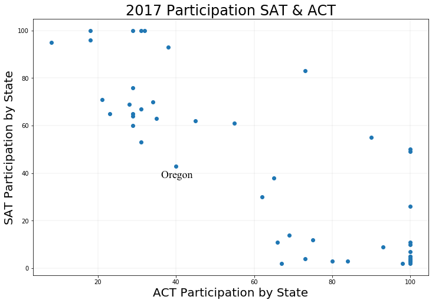
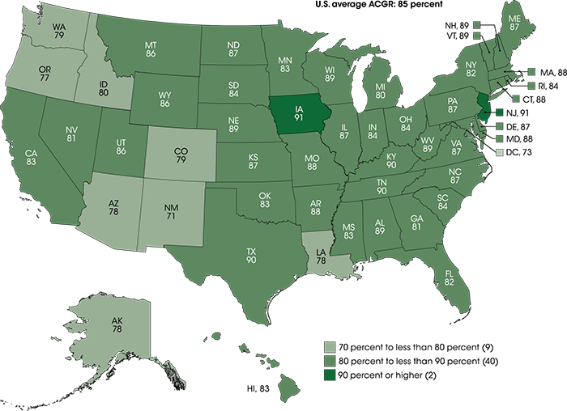
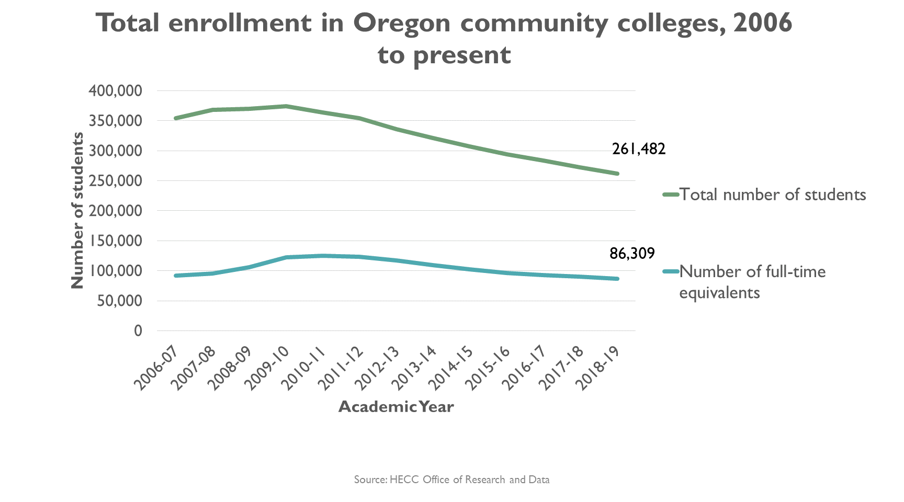

# SAT Participation in Oregon: A look into stagnant college preparedness and potential fixes 

---

## README Contents

---
---

- [Introduction](#introduction) 
- [Methodology](#methodology)
- [Datasets and Data Dictionary Used](#Datasets_Used)
- [Analysis and Findings](#analysis) 
- [Conclusions, Recommendations, & Further Research](#conclusion)
- [Sources](#sources)
##### Note: Sources for statements are below each section with a list of ALL sources used at the bottom of this document.

# Introduction 
---

### Problem Statement
The College Board's primary revenue stream is from the participation of students taking the SAT (Scholastic Aptitude Test) and the associated subtests (AP Tests) which are offered for a variety of subjects such as Math, Science, English, History, foreign languages, and others. College Board's audit is summed up in tables on Total Registration's site. It shows that since 2007 the College Board has made $800 million while administering over 5 million exams in 2018, double of what it administered in 2007. This comes with over double the profit of 2007 as well. Despite these facts, College Board stakeholders and executives should still be wary of the possibility of decline in participation which would directly lead to a loss in profit. According to the Washington Post nearly 40 percent of accredited colleges have dropped the SAT requirement from their admissions process. There is also the option to take other college readiness exams such as the ACT. Another Washington Post article states that only of recently (October 2018) the SAT surpassed the ACT in administered tests since 2012. To top it all off, future students may not even consider going to college with underemployment at roughly 40 percent according to the Wall Street Journal. This is the amount of college graduates who have jobs that do not require a college degree. Taking on crushing debt combined with no promise of a higher paying job are thoughts that linger in students and parents with students today. All these factors can contribute to a decrease in future test takers and thus future revenue. 

- ***Washington Post Article (Colleges Dropping SAT)***: https://www.washingtonpost.com/education/2019/10/18/record-number-colleges-drop-satact-admissions-requirement-amid-growing-disenchantment-with-standardized-tests/

- ***Prorepublica (College Board Audit)***: https://projects.propublica.org/nonprofits/organizations/131623965

- ***Total Registration (College Board Audit Summary)***: https://www.totalregistration.net/AP-Exam-Registration-Service/Follow-The-Money-History-of-College-Board-Finances.php

- ***Washington Post (SAT vs ACT Popularity)***: https://www.washingtonpost.com/education/2018/10/23/sat-reclaims-title-most-widely-used-college-admission-test/

- ***Wall Street Journal (Underemployment)***: https://www.wsj.com/articles/study-offers-new-hope-for-english-majors-1540546200

# Methodology 
---

The first step in looking for potential states for investment was to look at participation rates by state. We could ignore states with high rates of participation for the SAT as there is obviously not much room to increase the participation of students. We could also ignore states that had 100% ACT participation but required students by law to take the ACT such as Hawaii, Alabama, Kentucky, Louisianna, and more as changing education laws might prove to be a difficult task. Instead we decided to focus on states that overall had a low participation for both SAT and ACT, meaning that these states had no mandates for testing but had students that were apathetic towards taking college ready tests. These states have the most potential for growth and would therefore offer the best return on an investment. 

The goal was to find a state with both low ACT and SAT participation as the best potential hub for growth and ROI.  We simply applied a filter for finding participation of less than 50% for both 2017 and 2017. We were able to find that Oregon is our best potential candidate for investment.

The next step is to research and examine what reasons are there that this state might have low standardized test participation? Possible theories may be that it is a rural area and most of the economy does not require a college degree, or that the median income is lower in that state preventing students from going to college. Perhaps there aren't many colleges in the state or surrounding the state making the decision tougher for students? 

- ***List of states that require SAT/ACT***: https://www.princetonreview.com/college-advice/act-sat-state-requirements

# Datasets Used 
---

|Dataset|Description|Link|
|---|---|---|
|ACT 2017|2017 Average ACT Scores by State|https://blog.prepscholar.com/act-scores-by-state-averages-highs-and-lows||
|ACT 2018|2018 Average ACT Scores by State|http://www.act.org/content/dam/act/unsecured/documents/cccr2018/Average-Scores-by-State.pdf||
|SAT 2017|2017 Average SAT Scores by State |https://blog.collegevine.com/here-are-the-average-sat-scores-by-state/||
|SAT 2018|2018 Average SAT Scores by State|https://reports.collegeboard.org/sat-suite-program-results/state-results||

---

# Analysis and Findings 
---

### Analysis of National Participation and State Selection Process

In order to select the best candidate I filtered through our datasets to find states with less than 50% participation for both the SAT/ACT in 2017 and 2018. Oregon was the only state that fit this criteria. Visually from the scatter plot we can see that most states have an uneven split, around 60-40 between SAT/ACT, however Oregon represents a major outlier having values of around 40% for each test.

|Oregon|Stat Description|Value|
|---|---|---|
|ACT 2017|ACT Participation % for Oregon in 2017|40%|
|ACT 2018|ACT Participation % for Oregon in 2018 |42%|
|SAT 2017|SAT Participation % for Oregon in 2017|43%|
|SAT 2018|SAT Participation % for Oregon in 2018|48%|

---

### Oregon Findings

For this project we were not presented with datasets on individual states or any other materials other than statistics on the SAT/ACT. Outside resources were used to investigate reasons as to why Oregon may have low standardized test participation. Upon researching the Oregon education system I found that most recent articles had to do with Oregon schools underpforming and their test scores being some of their lowest in recent years. A few significant findings and the sources are listed below.

- Oregon has the 48th lowest high school graduation rate in the U.S.
- Oregon teachers get paid $2,200 higher than the national average but have 23% more students per teacher than the national average.
- Out of state enrollment has gone up however in state enrollment has been on a decline since 2008.
- Oregon ranks 2nd to last in terms of gap in achievement between lower income and higher income 4th and 8th graders.
- Only 13% of schools had funding at or above the average for individual student spending (42% national average).

***Figure 1, 2016-2017 Graduation Rates in the U.S.*** (nces.ed.gov)

---

***Figure 2, Total enrollment in Oregon Community Colleges 2006-2019*** - (Oregon.gov)

---

- ***Oregonlive***: https://www.oregonlive.com/education/2016/01/oregon_ranks_low_in_education.html
- ***opb.org***: https://www.opb.org/news/article/enrollment-decline-oregon-college-university-2018/
- ***bridgeliner.com***: https://bridgeliner.com/newsletter/2018-09-05-why-is-oregons-graduation-rate-so-so-bad/
- ***oregon.gov***: https://www.oregon.gov/ode/students-and-family/GraduationImprovement/Pages/GradSystems.
- https://www.oregon.gov/highered/research/Pages/student-data-cc.aspx
- ***nces.ed.gov***: https://nces.ed.gov/programs/coe/indicator_coi.asp

# Conclusions and Recommendations 

---

The data shows that Oregon's education system is severely lacking in resources to help lower income students graduate and go onto college. This has led to a significant decline in college enrollment over time. Further research could show how low graduation rates and low college educated populations can hinder economic growth, raise unemployment, and lead to increased crime. Although this is not an easy problem to fix by any means, College Board can aim to remedy the situation and potentially boost it's own profit in this situation.

The best case scenario is to campaign the state government to make taking the SAT mandatory. Although the state needs funding for education, College Board footing the bill in hopes that it makes a return years down the line is a risk especially for a state that has a history of underperforming. This recommendation aims to leverage a limited investment which will hopefully result in government spending continuing the investment while providing profit to College Board.

### Recommendation: Small SAT Prep Campaign 

A campaign could mention that Oregon is on the decline education wise and unless you prepare students to take a college readiness exam the number of college graduates in Oregon will continue to decline, which of course leads to the afforementioned problems of unemployment, crime, and a hindered economy. The goal is to get participation up without having to spend too much money. To convince legislation to change, College Board could run a trial program for a few years in select underperforming schools. Provide tutorting, after school help, free SAT Test Prep, free SAT tests, etc. If those students have a higher enrollment and graduation rate then that can be used to convince legislation to pour more money into SAT test prep and administration of the test, turning a profit to College Board.

# Sources
--- 

- ***Washington Post Article (Colleges Dropping SAT)***: https://www.washingtonpost.com/education/2019/10/18/record-number-colleges-drop-satact-admissions-requirement-amid-growing-disenchantment-with-standardized-tests/

- ***Prorepublica (College Board Audit)***: https://projects.propublica.org/nonprofits/organizations/131623965

- ***Total Registration (College Board Audit Summary)***: https://www.totalregistration.net/AP-Exam-Registration-Service/Follow-The-Money-History-of-College-Board-Finances.php

- ***Washington Post (SAT vs ACT Popularity)***: https://www.washingtonpost.com/education/2018/10/23/sat-reclaims-title-most-widely-used-college-admission-test/

- ***Wall Street Journal (Underemployment)***: https://www.wsj.com/articles/study-offers-new-hope-for-english-majors-1540546200

- ***List of states that require SAT/ACT***: https://www.princetonreview.com/college-advice/act-sat-state-requirements
- ***Washington Post Article (Colleges Dropping SAT)***: https://www.washingtonpost.com/education/2019/10/18/record-number-colleges-drop-satact-admissions-requirement-amid-growing-disenchantment-with-standardized-tests/

- ***Prorepublica (College Board Audit)***: https://projects.propublica.org/nonprofits/organizations/131623965

- ***Total Registration (College Board Audit Summary)***: https://www.totalregistration.net/AP-Exam-Registration-Service/Follow-The-Money-History-of-College-Board-Finances.php

- ***Washington Post (SAT vs ACT Popularity)***: https://www.washingtonpost.com/education/2018/10/23/sat-reclaims-title-most-widely-used-college-admission-test/

- ***Wall Street Journal (Underemployment)***: https://www.wsj.com/articles/study-offers-new-hope-for-english-majors-1540546200

- ***List of states that require SAT/ACT***: https://www.princetonreview.com/college-advice/act-sat-state-requirements

---
